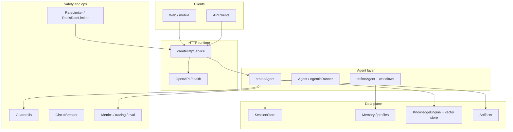

# 17 · Full framework showcase (real-world map)

This page is a **single narrative** that touches **every major capability** in confused-ai: one fictional product, with imports you can copy into your own app. Deep dives live in the numbered examples and guides linked throughout.

---

## The story: NorthPeak StoreOps Copilot

**NorthPeak Retail** ships an internal assistant for store managers:

- Answers **policy and procedure** questions from uploaded PDFs (RAG).
- Runs **safe tools** (calculator, HTTP lookups, optional MCP integrations).
- **Remembers** the conversation per store via sessions; **profiles** repeat users.
- Uses **workflows** (plan → compose), **pipelines** for handoffs, and optional **supervisor / team** patterns for escalation.
- Ships behind **HTTP + OpenAPI**, with **health checks**, **rate limits**, **circuit breakers**, **guardrails**, and **observability** (logs, metrics, evals, optional Langfuse/LangSmith batches).

You do not need one monolith file in production—this page shows **how each concern maps to a module** so you can adopt pieces incrementally.

---

## Architecture (how the pieces fit)



---

## Runnable scripts in this repo

Run these from the **repository root** (they import `src/` paths; published apps use `confused-ai` imports instead).

| Script | Command | What it demonstrates |
|--------|---------|----------------------|
| **Full LLM tour** | `bun run example:showcase` | `createAgent`, sessions, tools, guardrails, logger, streaming hooks, `defineAgent` + `createWorkflow` (sequential + parallel), `createPipeline` + `asOrchestratorAgent`, planner + memory, health, metrics, OpenAPI; add `--http` for `createHttpService` |
| **Module sampler (no LLM)** | `bun run example:potential` | `splitText`, circuit breaker, rate limiter, artifacts, learning profiles, eval metrics, `loadConfig` |
| **Minimal agent** | `bun run example:simple` | Smallest `createAgent` setup |

---

## Capability checklist → imports

Use this as a **coverage map** against **`CAPABILITIES.md`** at the repository root (same checklist the maintainers update with each release).

### Core agent loop

| Capability | Example import |
|------------|----------------|
| Opinionated agent | `import { createAgent } from 'confused-ai'` |
| ReAct / tool loop (bring your own LLM) | `import { createAgenticAgent } from 'confused-ai/agentic'` |
| Class-based `Agent` | `import { Agent } from 'confused-ai'` |
| Fluent DX builder | `import { defineAgent } from 'confused-ai'` (DX chain under `confused-ai` — see [Creating Agents](/guide/agents)) |
| Typed Zod agents (SDK) | `import { defineAgent, createWorkflow, asOrchestratorAgent } from 'confused-ai'` |

```ts
import { createAgent, resolveLlmForCreateAgent } from 'confused-ai';
import { CalculatorAddTool } from 'confused-ai/tools';
import { InMemorySessionStore } from 'confused-ai/session';

const agent = createAgent({
  name: 'StoreOps',
  instructions: 'Help store managers with policy and math. Use calculator_add when adding numbers.',
  sessionStore: new InMemorySessionStore(),
  tools: [new CalculatorAddTool()],
  llm: resolveLlmForCreateAgent(
    { name: 'StoreOps', instructions: '_' },
    { model: 'gpt-4o-mini', apiKey: process.env.OPENAI_API_KEY! }
  ),
});
```

### Tools & integrations

| Capability | Example import |
|------------|----------------|
| Built-in tools | `import { … } from 'confused-ai/tools'` |
| Registry | `import { ToolRegistryImpl, toToolRegistry } from 'confused-ai/tools'` |
| MCP HTTP client | `import { HttpMcpClient, loadMcpToolsFromUrl } from 'confused-ai/tools'` |
| MCP HTTP server | `import { McpHttpServer, createMcpServer } from 'confused-ai/tools'` |
| MCP stdio (minimal) | `import { runMcpStdioToolServer, handleMcpStdioLine } from 'confused-ai/tools'` |
| JSON tool gateway | `import { handleToolGatewayRequest } from 'confused-ai/tools'` |
| Playwright (optional peer) | `import { PlaywrightPageTitleTool } from 'confused-ai/tools'` |

```ts
import { createWorkflow, defineAgent } from 'confused-ai';
import { CalculatorAddTool } from 'confused-ai/tools';
import { z } from 'zod';

const analyst = defineAgent({
  name: 'analyst',
  inputSchema: z.object({ question: z.string() }),
  outputSchema: z.object({ answer: z.string() }),
  tools: [new CalculatorAddTool()],
  handler: async (input) => ({ answer: `Thought about: ${input.question}` }),
});

const wf = createWorkflow();
const out = await wf.task('analyst', analyst).sequential().execute({ question: 'Q4 foot traffic?' });
```

### Session, memory, knowledge

| Capability | Example import |
|------------|----------------|
| Sessions (memory / SQL / SQLite / Redis) | `import { InMemorySessionStore, RedisSessionStore, createSqliteSessionStore } from 'confused-ai/session'` |
| Redis LLM cache | `import { RedisLlmCache } from 'confused-ai/session'` |
| Semantic / episodic memory | `import { InMemoryStore, MemoryType } from 'confused-ai'` |
| Vector stores | `import { PineconeVectorStore, QdrantVectorStore, PgVectorStore, InMemoryVectorStore } from 'confused-ai/memory'` |
| User profiles | `import { InMemoryUserProfileStore } from 'confused-ai/learning'` |
| RAG | `import { KnowledgeEngine, TextLoader, splitText } from 'confused-ai/knowledge'` |

```ts
import { KnowledgeEngine, splitText } from 'confused-ai/knowledge';
import { InMemoryVectorStore } from 'confused-ai/memory';
import { OpenAIEmbeddingProvider } from 'confused-ai/llm';

const chunks = splitText('Return policy: 30 days. Receipt required.', { chunkSize: 40, chunkOverlap: 8 });

const rag = new KnowledgeEngine({
  vectorStore: new InMemoryVectorStore(),
  embeddingProvider: new OpenAIEmbeddingProvider({ apiKey: process.env.OPENAI_API_KEY! }),
});

await rag.ingest([
  {
    content: chunks.join('\n'),
    metadata: { store: 'northpeak' },
    source: 'return-policy-v3',
  },
]);
```

### Safety & planning

| Capability | Example import |
|------------|----------------|
| Guardrails | `import { GuardrailValidator, createSensitiveDataRule, createPiiDetectionRule } from 'confused-ai/guardrails'` |
| Planners | `import { ClassicalPlanner, PlanningAlgorithm } from 'confused-ai/planner'` |
| Execution graphs | `import { … } from 'confused-ai/execution'` |

```ts
import { GuardrailValidator, createSensitiveDataRule } from 'confused-ai/guardrails';

const guardrails = new GuardrailValidator({
  rules: [createSensitiveDataRule()],
});
```

### Orchestration

| Capability | Example import |
|------------|----------------|
| Pipeline | `import { createPipeline } from 'confused-ai/orchestration'` |
| Supervisor, swarm, team, toolkit | `import { … } from 'confused-ai/orchestration'` |
| Agent router (**orchestration** strategy type) | `import type { AgentRoutingStrategy } from 'confused-ai/orchestration'` |
| A2A client | `import { HttpA2AClient, createHttpA2AClient } from 'confused-ai/orchestration'` |

::: tip
The **LLM** router uses `RoutingStrategy` from `confused-ai/llm`. The **multi-agent** router uses `AgentRoutingStrategy` from `confused-ai/orchestration`—do not confuse the two.
:::

### Observability & quality

| Capability | Example import |
|------------|----------------|
| Logging / metrics / tracer | `import { ConsoleLogger, MetricsCollectorImpl, InMemoryTracer } from 'confused-ai/observability'` |
| Eval metrics | `import { wordOverlapF1, rougeLWords, ExactMatchAccuracy } from 'confused-ai/observability'` |
| LLM-as-judge | `import { runLlmAsJudge } from 'confused-ai/observability'` |
| Langfuse / LangSmith (HTTP helpers) | `import { sendLangfuseBatch, sendLangSmithRunBatch } from 'confused-ai/observability'` |
| OTLP | `import { OTLPTraceExporter, OTLPMetricsExporter } from 'confused-ai/observability'` |

```ts
import { MetricsCollectorImpl } from 'confused-ai/observability';

const metrics = new MetricsCollectorImpl();
metrics.counter('northpeak_queries', 1, { region: 'us-west' });
```

### Production & resilience

| Capability | Example import |
|------------|----------------|
| Health | `import { HealthCheckManager, createSessionStoreHealthCheck } from 'confused-ai/production'` |
| Rate limiting (process) | `import { RateLimiter, createOpenAIRateLimiter } from 'confused-ai/production'` |
| Rate limiting (Redis) | `import { RedisRateLimiter } from 'confused-ai/production'` |
| Circuit breaker | `import { CircuitBreaker, createLLMCircuitBreaker } from 'confused-ai/production'` |
| Streams / shutdown | `import { ResumableStreamManager, GracefulShutdown } from 'confused-ai/production'` |

### Artifacts & media

| Capability | Example import |
|------------|----------------|
| Versioned outputs | `import { InMemoryArtifactStorage, createTextArtifact } from 'confused-ai/artifacts'` |
| Media / video helpers | `import { … } from 'confused-ai'` (video module) |

### HTTP service

| Capability | Example import |
|------------|----------------|
| API + SSE + OpenAPI | `import { createHttpService, listenService, getRuntimeOpenApiJson } from 'confused-ai/runtime'` |

```ts
import { createHttpService, listenService } from 'confused-ai/runtime';

const service = createHttpService(
  { agents: { storeops: agent }, tracing: true, cors: '*' },
  8787
);
await listenService(service, 8787);
```

### Config

| Capability | Example import |
|------------|----------------|
| Env-based config | `import { loadConfig, validateConfig } from 'confused-ai/config'` |

### LLM providers & structured streaming

| Capability | Example import |
|------------|----------------|
| OpenAI / Anthropic / Google / compat | `import { OpenAIProvider, AnthropicProvider, GoogleProvider, … } from 'confused-ai/llm'` |
| Bedrock (optional SDK) | `import { BedrockConverseProvider } from 'confused-ai/llm'` |
| Smart model routing (no extra LLM call) | `import { createSmartRouter, scoreTaskTypesForRouting } from 'confused-ai/llm'` |
| Stream → Zod | `import { collectStreamText, collectStreamThenValidate } from 'confused-ai/llm'` |
| Context limits | `import { getContextLimitForModel, ContextWindowManager } from 'confused-ai/llm'` |

```ts
import { z } from 'zod';
import { collectStreamThenValidate, type StreamDelta } from 'confused-ai/llm';

async function structuredFromStream(stream: AsyncIterable<StreamDelta>) {
  const schema = z.object({ summary: z.string(), risk: z.enum(['low', 'medium', 'high']) });
  return collectStreamThenValidate(stream, { schema });
}
```

---

## Where to go next

| Topic | Doc |
|-------|-----|
| Step-by-step tutorials | [Examples index](./index.md) · [Getting Started](/guide/getting-started) |
| RAG details | [RAG guide](/guide/rag) · [Example 05 · RAG](./05-rag) |
| Multi-agent | [Orchestration](/guide/orchestration) · [Example 08](./08-team) · [09](./09-supervisor) |
| Production | [Resilience](/guide/production) · [Example 13](./13-production) |
| MCP | [MCP guide](/guide/mcp) · [Example 14](./14-mcp) |
| Full-stack shape | [Example 15](./15-full-stack) |
| Model routing | [Example 16](./16-llm-router) |

---

## NorthPeak “minimum viable” stack (opinionated)

If you only wire **one** path first:

1. **`createAgent`** + **`InMemorySessionStore`** (or Redis in production).
2. **`KnowledgeEngine`** + a real **vector store** for policy docs.
3. **`GuardrailValidator`** + at least one **PII or sensitive-data** rule.
4. **`createHttpService`** + **`HealthCheckManager`** for deploys.
5. **`RateLimiter`** or **`RedisRateLimiter`** on hot routes.
6. **`MetricsCollectorImpl`** (or OTLP) for dashboards.

Then add **workflows**, **MCP**, **A2A**, and **Bedrock** when a concrete integration requires them.

The runnable **`examples/framework-showcase.ts`** file in the repo is the closest **end-to-end code** counterpart to this page; diff it against your app’s `package.json` imports when you migrate from repo-relative paths to `confused-ai`.
