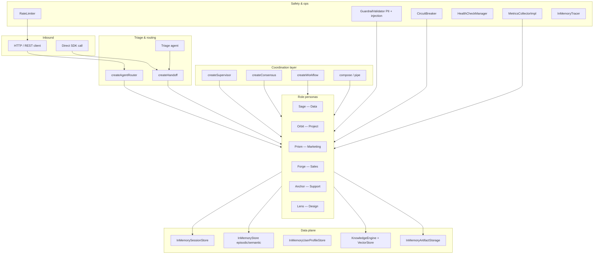

# 18 · Meridian — Role Intelligence Platform 🔴

Build a complete enterprise AI persona platform with confused-ai.
**Meridian** turns organizational knowledge into always-on, role-specific AI co-pilots
that assist teams in real time — covering every major framework surface area in one
runnable example.

---

## What you'll learn

- How to design and compose **role-based AI personas** with the `definePersona` fluent builder
- Layered **guardrails**: PII detection, forbidden topics, prompt injection guards
- **RAG knowledge** per role using `KnowledgeEngine`, `splitText`, and `InMemoryVectorStore`
- **Intelligent triage + handoff**: route requests to the right specialist automatically
- **Capability-based routing** with `createAgentRouter`
- **Supervisor coordination**: one agent delegates to multiple specialists in sequence or parallel
- **Consensus decisions**: majority-vote across N agents with configurable quorum
- **Sequential pipelines** with `compose()` and `pipe()`
- **Typed workflows** (`createWorkflow`) for parallel data gathering + sequential synthesis
- **Multi-turn sessions**, long-term **episodic/semantic memory**, and **user profiles**
- **Observability**: structured logger, metrics counters + histograms, distributed traces, eval accuracy
- **Resilience**: circuit breaker + token-bucket rate limiter
- **Health checks** (liveness + full component status)
- **Artifact storage** for persisting role outputs
- **DX escape hatches**: `bare()` and `defineAgent().noDefaults()`
- **HTTP runtime**: serve all personas behind a single API with OpenAPI + auth

---

## Runnable scripts

```bash
# Demo mode (no LLM key needed — all bootstrap sections run)
bun run example:meridian

# Live mode (requires OPENAI_API_KEY in examples/.env)
echo "OPENAI_API_KEY=sk-..." >> examples/.env
bun run example:meridian

# HTTP server — serve all 6 personas on :8877
bun run example:meridian -- --http

# Custom port
bun run example:meridian -- --http --port=9000
```

---

## The six Meridian personas

| Name | Role | Capabilities |
|------|------|-------------|
| **Sage** | Data & Analytics | `data`, `analytics`, `sql`, `metrics`, `forecast` |
| **Orbit** | Project & Delivery | `project`, `planning`, `agile`, `sprint`, `risk` |
| **Prism** | Growth & Marketing | `marketing`, `campaign`, `seo`, `brand`, `growth` |
| **Forge** | Revenue & Sales | `sales`, `deal`, `crm`, `pipeline`, `quota` |
| **Anchor** | Customer Support | `support`, `ticket`, `escalation`, `customer` |
| **Lens** | UX & Product Design | `design`, `ux`, `accessibility`, `prototype` |

Each persona is built with the fluent `definePersona()` builder and produces a
self-contained system prompt:

```ts
import { definePersona } from 'confused-ai';

const sage = definePersona()
  .displayName('Sage')
  .role('Senior Data & Analytics specialist who transforms raw data into decision-grade insight.')
  .expertise(['SQL and statistical analysis', 'KPI frameworks', 'A/B testing', 'Trend forecasting'])
  .tone('Precise and data-driven — every claim is backed by evidence.')
  .audience('Business analysts, product managers, and executive stakeholders.')
  .responseStyle('Lead with the key number. Follow with methodology. Close with one recommendation.')
  .constraints([
    'Never invent data — request the actual dataset.',
    'Flag correlation vs. causation explicitly.',
  ])
  .instructions(); // → ready-to-use system prompt string
```

---

## Architecture



---

## Key patterns

### Guardrails (layered safety)

```ts
import {
  GuardrailValidator,
  createSensitiveDataRule,
  createPiiDetectionRule,
  createForbiddenTopicsRule,
  createPromptInjectionRule,
} from 'confused-ai';

const guardrails = new GuardrailValidator({
  rules: [
    createSensitiveDataRule(),
    createPiiDetectionRule({ types: ['email', 'phone', 'ssn', 'credit_card'] }),
    createForbiddenTopicsRule({ topics: ['competitor pricing', 'internal salary data'] }),
    createPromptInjectionRule({ throwOnDetection: false }),
  ],
});
```

### Triage + handoff

```ts
import { createHandoff } from 'confused-ai';

const handoff = createHandoff({
  from: triageAgent,
  to: { data: sage, project: orbit, marketing: prism, sales: forge, support: anchor, design: lens },
  router: async (ctx) => {
    if (ctx.prompt.includes('metric'))   return 'data';
    if (ctx.prompt.includes('sprint'))   return 'project';
    if (ctx.prompt.includes('campaign')) return 'marketing';
    return 'support'; // fallback
  },
});

const result = await handoff.execute('Our Q2 dashboard metrics are falling behind');
console.log('Handled by:', result.toAgent);
```

### Supervisor delegation

```ts
import { createSupervisor, createRole } from 'confused-ai';

const supervisor = createSupervisor({
  name: 'MeridianSupervisor',
  subAgents: [
    { agent: sage,  role: createRole('data-specialist',      'Metrics and analysis') },
    { agent: prism, role: createRole('marketing-specialist', 'Campaign strategy') },
    { agent: forge, role: createRole('sales-specialist',     'Pipeline guidance') },
  ],
  coordinationType: 'sequential',
});
```

### Consensus decisions

```ts
import { createConsensus } from 'confused-ai';

const panel = createConsensus({
  agents: { orbit, forge, prism },
  strategy: 'majority-vote',
  quorum: 2,
  parallel: true,
});

const decision = await panel.decide(
  'Should we prioritise APAC expansion in Q3?'
);
console.log(decision.decision, '— confidence:', decision.confidence);
```

### compose() deal-to-campaign pipeline

```ts
import { compose } from 'confused-ai';

const dealToCampaign = compose(
  forge,  // surfaces deal insights
  prism,  // turns them into campaign copy
  {
    when:      (result) => (result.text?.length ?? 0) > 20,
    transform: (result) => `Sales insights:\n\n${result.text}\n\nCraft a campaign angle.`,
  },
);

const result = await dealToCampaign.run('Top 3 enterprise deals closing this quarter');
```

### pipe() three-stage workflow

```ts
import { pipe } from 'confused-ai';

const plan = pipe(sage)
  .then(orbit, { transform: (r) => `Data context:\n${r.text}\n\nCreate a project plan.` })
  .then(prism,  { transform: (r) => `Project plan:\n${r.text}\n\nSuggest the launch campaign.` });

const result = await plan.run('What are our top conversion metrics this quarter?');
```

### HTTP runtime (all 6 personas)

```ts
import { createHttpService, listenService } from 'confused-ai';

const svc = createHttpService(
  { agents: { sage, orbit, prism, forge, anchor, lens }, tracing: true, cors: '*' },
  8877,
);
await listenService(svc, 8877);

// POST /v1/chat  { "agent": "anchor", "message": "Customer says onboarding is broken" }
// GET  /v1/health
// GET  /v1/openapi.json
```

---

## Module coverage map

| Module | API used |
|--------|----------|
| Persona builder | `definePersona`, `buildPersonaInstructions` |
| Agent factory | `createAgent`, `agent`, `bare`, `defineAgent` |
| Sessions | `InMemorySessionStore`, multi-turn `run({ sessionId })` |
| Memory | `InMemoryStore`, `MemoryType.EPISODIC`, `MemoryType.SEMANTIC` |
| Profiles | `InMemoryUserProfileStore`, `LearningMode.AGENTIC` |
| Knowledge / RAG | `KnowledgeEngine`, `splitText`, `InMemoryVectorStore` |
| Pipelines | `compose`, `pipe` |
| Handoff | `createHandoff`, `HandoffProtocol` |
| Router | `createAgentRouter`, `capability-match` strategy |
| Supervisor | `createSupervisor`, `createRole` |
| Consensus | `createConsensus`, `majority-vote` strategy |
| Workflow | `createWorkflow`, `.parallel()`, `.sequential()` |
| Guardrails | `GuardrailValidator`, PII, injection, forbidden topics |
| Hooks | `beforeRun`, `afterRun`, `onError`, `buildSystemPrompt` |
| Observability | `ConsoleLogger`, `MetricsCollectorImpl`, `InMemoryTracer` |
| Eval | `ExactMatchAccuracy`, `LevenshteinAccuracy` |
| Resilience | `CircuitBreaker`, `RateLimiter` |
| Health | `HealthCheckManager`, `createCustomHealthCheck` |
| Artifacts | `InMemoryArtifactStorage`, `createTextArtifact` |
| HTTP runtime | `createHttpService`, `listenService`, `getRuntimeOpenApiJson` |
| Config | `loadConfig` |

---

## See also

- [11 · Customer Support Bot](./11-support-bot) — single-persona support flow in depth
- [09 · Supervisor Workflow](./09-supervisor) — supervisor pattern deep dive
- [05 · RAG Knowledge Base](./05-rag) — knowledge engine with real embeddings
- [15 · Full-Stack App](./15-full-stack) — HTTP + agent + storage in production
- [16 · Intelligent LLM Router](./16-llm-router) — route by cost and quality
- [17 · Full Framework Showcase](./17-full-framework-showcase) — capability coverage map
